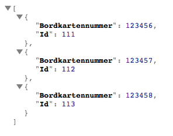
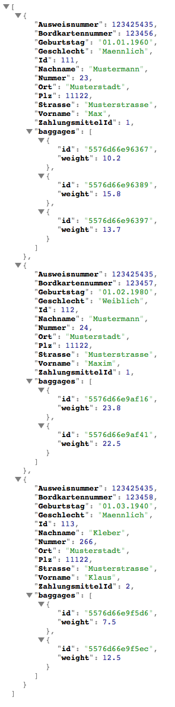

# Virtual Airline Wildau: Frachtsimulation

## 1. Einleitung
Die **Virtual Airline Wildau** ist ein Projekt der TH-Wildau, das beginnend mit der IM-14 die Abläufe eines Flughafens
und verschiedener Fluglinien simulieren soll. Hierfür wurden zunächst Gruppen für die App, die Frachtverwaltung und
das Vorfeld gebildet. Zudem werden die drei Gruppen durch das Projektbüro unterstützt, die für die Implementierung
der Flughafen API zuständig sind, welche zunächst nur als Mock vorliegt.
Dieses Repository beinhaltet die Simulation der Frachtgruppe und besteht aus einer Serverkomponente,
einer Inputsimulation, einer Hardwaresimulation und einem Mock der Flughafen API (zu Testzwecken).

## 2. Installation
Die einzelnen Bestandteile der Applikation werden auf verschiedenen Server gehostet und besitzen eigene URLs.
Im Folgenden wird die Einrichtung der Komponenten erklärt. Im Laufe der Entwicklung wird dieses Dokument
erweitert und die Installationsprozesse noch weiter angepasst.

### 2.1 Flughafen API
Im Ordner ```flightApiMock``` befindet sich der Mock zur Flughafen API. In diesem muss zunächst der Befehl
```composer install``` aufgerufen werden um die Vendordateien zu installieren. Die Konfiguration des Webservers
sollte anschließend auf den Ordner ```/flightApiMock``` angepasst werden. Als URL wird die Adresse ```flight.vaw.local```
empfohlen, da diese bereits in den anderen Modulen vorkonfiguriert ist. Der Port sollte außerdem auf ```8888``` stehen,
was dem MAMP (Pro) Standard entspricht.

### 2.2 Input Simulation
Im Ordner ```inputSimulation``` befindet sich die Inputsimulation. Diese dient der Simulation mehrerer Passagiere, die
ihr Gepäck aufgeben wollen. Auch hier müssen zunächst mit dem Befehl ```composer install``` die Vendordateien heruntergeladen
werden. Die Konfiguration des Webservers zeigt erneut auf den eben verwendeten Ordner, in diesem Fall
 ```/inputSimulation```. Als URL wird die Adresse ```input.vaw.local```
empfohlen, um weitere Konfigurationen zu vermeiden. Auch hier sollte der Port auf ```8888``` eingestellt werden.

### 2.3 Server Component
In dem Ordner ```serverComponent```liegt die Server Komponente. Die Server Komponente hat als einziges Modul eine Anbindung an die Datenbank und dient dem System daher als Persistenzmodul.

## 3. Verwendung
Die Komponenten stellen eine Reihe von Endpoints zu Verfügung, die an dieser Stelle kurz erläutert werden sollen.

### 3.1 Flughafen API

**GET:** http://flight.vaw.local:8888/api/list

Ruft eine Liste aller ids und Bordkartennummern der bekannten Passagiere aus. Die Liste der Passagiere wird hierfür in
der Datei ```/flightApiMock/passagiere.yml``` angelegt. Zu Testzwecken sind bereits drei Passagiere angelegt, die
für eine einfache Überprüfung der Funktionalität genügen sollten.
Die Ausgabe erfolgt in JSON und ist in der folgenden Abbildung dargestellt.



---

**GET:** http://flight.vaw.local:8888/api/:Bordkartennummer

Ruft die Passagierdetails zu einer Bordkartennumer auf. Das ausgegebene JSON ist eine vereinfachten Darstellung der echten Flug API,
genügt aber den Ansprüchen der Input Simulation.


### 3.2 Input Simulation

**GET:** http://input.vaw.local:8888/

Simuliert die Gepäckeingabe für alle Passiegere, die http://flight.vaw.local:8888/api/list zurückgibt.
Pro Passagier wird ein weiterer Request an den Endpoint http://flight.vaw.local:8888/api/:Bordkartennummer abgegeben und
dann zwischen einem und drei Gepäckstücke erzeugt. Momentan erfolgt die Baggage.id Zuweisung über einen
Mockadapter, der später gegen die Schnittstelle des Servers ausgetauscht wird.



### 3.4 Server Component

**GET:** http://server.vaw.local:8888/api/baggage

**POST:** http://server.vaw.local:8888/api/baggage <- Params: passenger_id

## 4. Todo
* Schreiben der Serverkomponente
* Austausch des Flughafen API Mocks, gegen die echte Schnittstelle des Projektbüros
* Simulation der Einzelschritte (User Input) innerhalb der Inputsimulation
